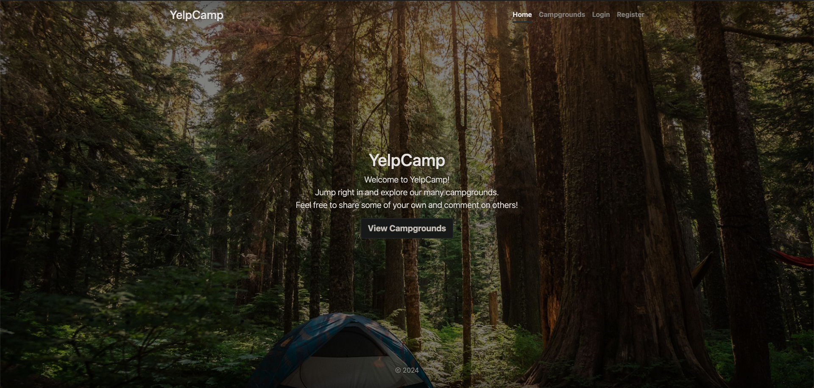

## YelpCamp

<!-- Live App: https://yelpcamp-s39h.onrender.com/ -->

- [Introduction](#introduction)
- [Features](#features)
- [Dependencies](#dependencies)
- [Planning and Designing](#planning-and-designing)

## Introduction

YelpCamp is a full-stack web application that enables users to explore and review campgrounds. It provides a comprehensive platform for discovering and sharing experiences at various campgrounds, making it ideal for camping enthusiasts looking to plan their next adventure or seek inspiration from others in the community.

## Features:

* Secure User Authentication: Easily sign up, log in, and access exclusive features like adding new campgrounds and leaving reviews.
* Comprehensive Campground Listings: Browse detailed campsite information including reviews, ratings, amenities, and photos.
* User Contributions: Enrich the platform by adding new campgrounds with essential details and images.
* Adding New Campgrounds: Registered users can add new campgrounds to the platform. This typically involves providing information such as name, description, location, and uploading images.
* Reviews and Ratings: Share experiences to help others make informed decisions.
* Interactive Maps: Explore campground locations with ease.
* Efficient Search and Filtering: Find campgrounds based on location, amenities, or ratings.
* Responsive Design: Enjoy seamless usability across devices.
* Logical RESTful Routing: Navigate intuitively with structured URL patterns.
* Persistent Data Storage: Ensure data continuity and reliability with MongoDB.

## Dependencies 
    "@mapbox/mapbox-sdk": "^0.15.3",
    "cloudinary": "^1.41.3",
    "connect-flash": "^0.1.1",
    "connect-mongo": "^3.2.0",
    "dotenv": "^16.4.4",
    "ejs": "^3.1.9",
    "ejs-mate": "^4.0.0",
    "express": "^4.18.2",
    "express-mongo-sanitize": "^2.2.0",
    "express-session": "^1.18.0",
    "helmet": "^7.1.0",
    "joi": "^17.11.0",
    "method-override": "^3.0.0",
    "mongoose": "^8.0.3",
    "multer": "^1.4.5-lts.1",
    "multer-storage-cloudinary": "^4.0.0",
    "nodemon": "^3.0.2",
    "passport": "^0.7.0",
    "passport-local": "^1.0.0",
    "passport-local-mongoose": "^8.0.0",
    "sanitize-html": "^2.12.1"

## Planning and Designing

* Define the features and functionality of YelpCamp, including user authentication, campground listings, reviews, etc.

## Building the Frontend:
* Develop the frontend with HTML, CSS, and JavaScript.
* Use EJS templating for dynamic HTML.
* Create responsive layouts using Bootstrap.
* Implement client-side validation and error handling.

## Creating the Backend:
* Set up the backend with Node.js and Express.js.
* Configure middleware for requests, JSON parsing, and static files.
* Implement user authentication with Passport.js.
* Define MongoDB models for data storage.
* Create RESTful routes for CRUD operations.

## Integrating User Authentication:
* Create authentication routes for registration, login, and logout.
* Implement middleware for route protection.
* Manage sessions and cookies for user sessions.

## Implementing Campground Features:
* Develop routes and views for campground listings.
* Enable campground addition with forms.
* Add features like image uploads and maps.

## Adding Review Functionality:
* Create routes and views for campground reviews.
* Allow users to add, edit, and delete reviews.
* Calculate and display average ratings.

## Testing and Debugging:
* Test functionality across browsers and devices.
* Debug encountered issues.

## Deployment:
* Choose a hosting provider and deploy the app.
* Set up MongoDB Atlas for production data storage.

## Continuous Improvement:
* Monitor performance and security.

## Running it locally:

1. Install mongodb.
2. Create a cloudinary account to get an API key and secret code.
3. Create a mapbox account to get a token.

Install node, using the Node Version Manager.

Alternatively, you can use nodemon to run the app.

`git clone git@github.com:jpdieter/YelpCamp.git`
`cd YelpCamp`
`npm install`

I am using SSH based authentication. The alternative for token-based authentication is:

`https://github.com/jpdieter/YelpCamp.git`

Create a .env file (or just export manually in the terminal), and run this command:

`cp sample.env .env`

Run mongod in another terminal and node app.js or nodemon app.js in the terminal with the project.

Then go to localhost:3000
